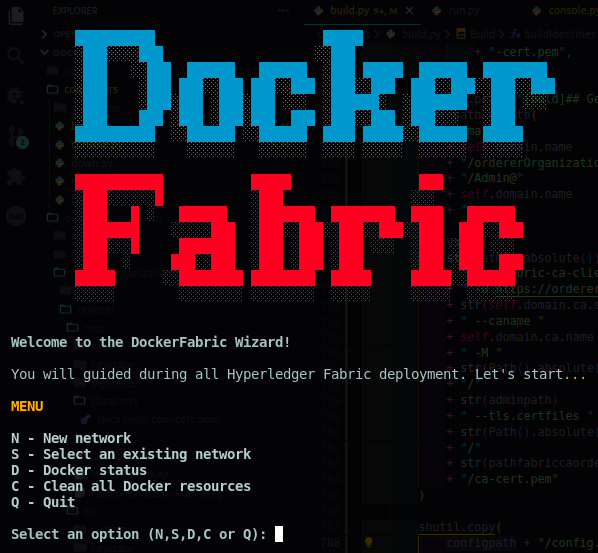
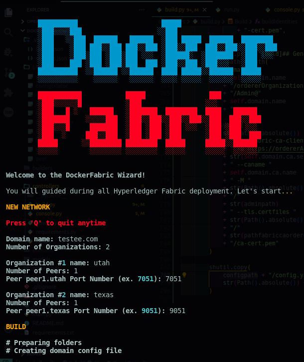
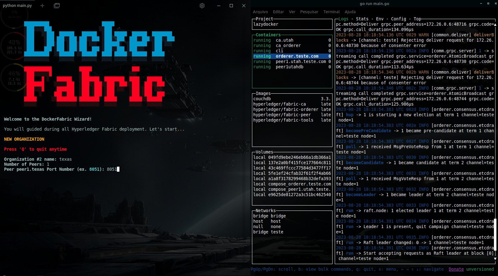
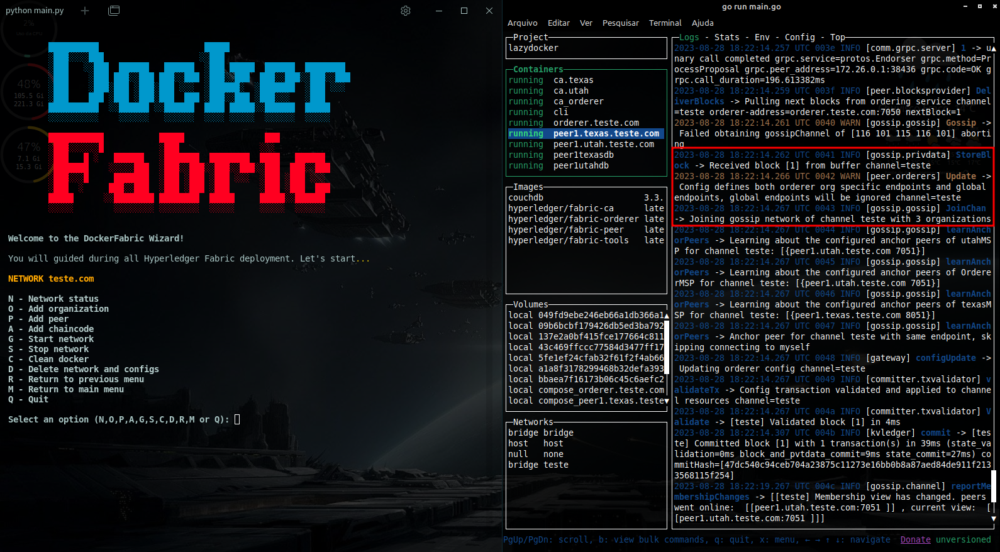
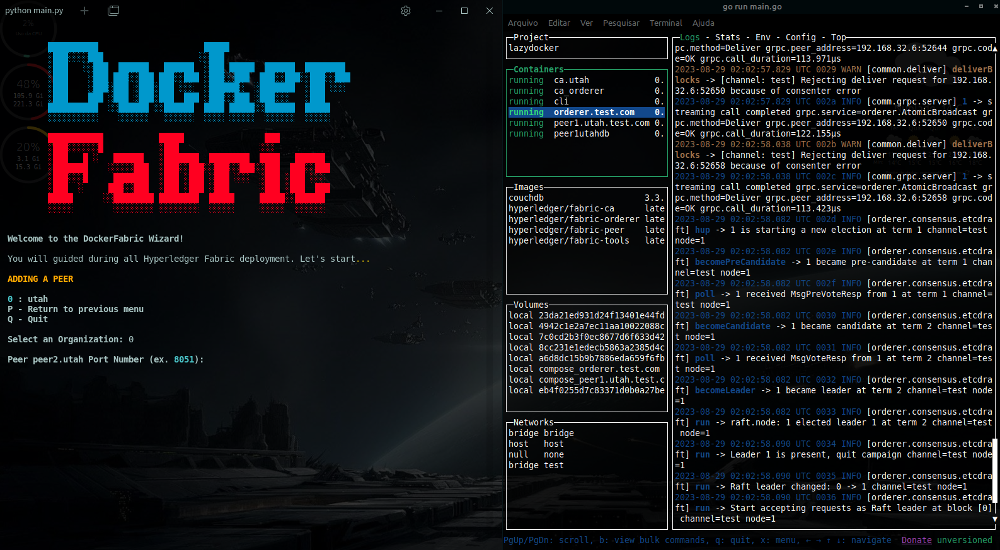
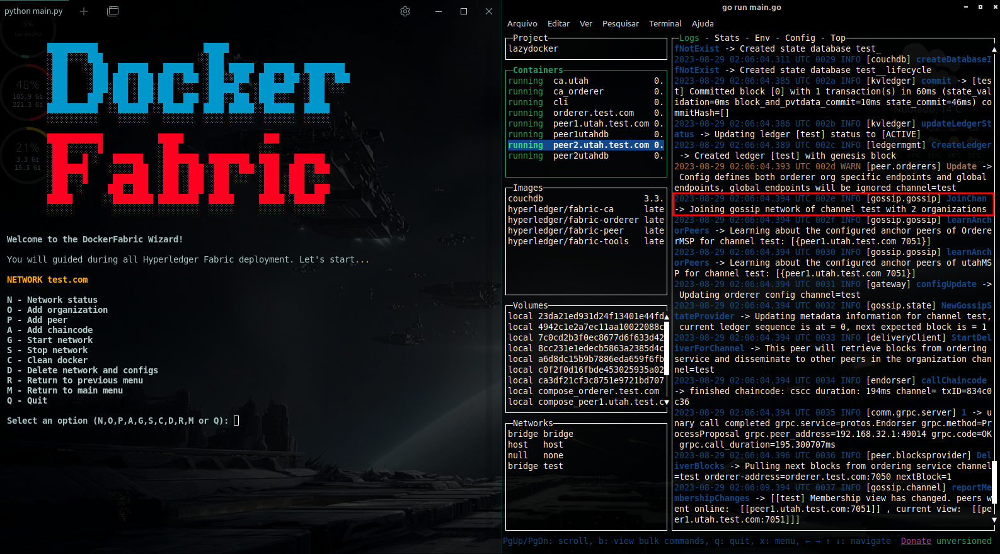
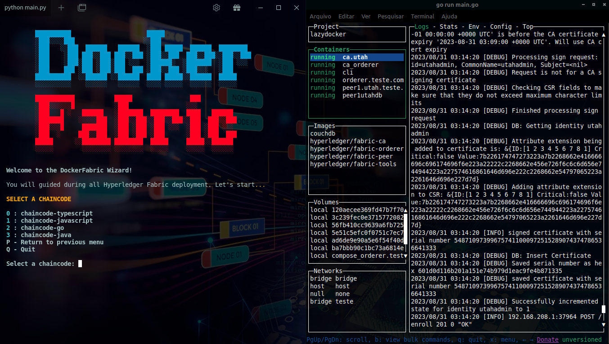
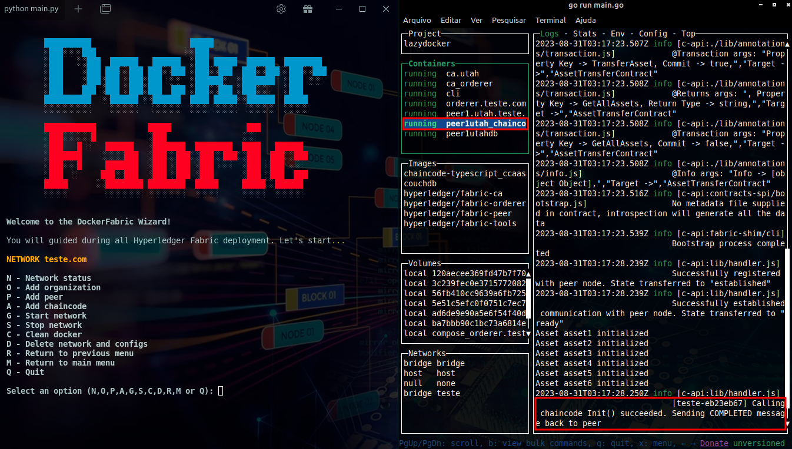

# Docker Fabric Wizard

Welcome to Docker Fabric Wizard, a tool designed to simplify the automated installation of [Hyperledger Fabric](https://www.hyperledger.org/projects/fabric) using [Docker](https://hub.docker.com/u/hyperledger/) containers. This tool is aimed at professionals and students interested in blockchain technology.

> __Warning__
This project is under development, however you can use it to build your Hyperledger Fabric network from scratch. It is also not an official [Hyperledger Fabric](https://www.hyperledger.org/projects/fabric) tool.


## Table of Contents

- [Overview](#overview)
- [Prerequisites](#prerequisites)
- [Installation](#installation)
- [Usage](#usage)
- [Chaincode Deploy](#how-to-deploy-a-chaincode-chaincode-as-a-service---ccaas)
- [Screenshots](#screenshots)
- [Contributing](#contributing)
- [Development Status](#development-status)
- [License](#license)

## Overview

Docker Fabric Wizard streamlines the process of setting up a [Hyperledger Fabric](https://www.hyperledger.org/projects/fabric) network by utilizing [Docker](https://hub.docker.com/u/hyperledger/) containers. It offers an automated installation process based on user-provided network structure details. The tool generates and configures the necessary [Docker](https://hub.docker.com/u/hyperledger/) containers, allowing you to quickly deploy a [Hyperledger Fabric](https://www.hyperledger.org/projects/fabric) network for development, testing, or educational purposes.

## Prerequisites

Before you begin, make sure you have the following prerequisites:

- Linux OS (don't use Windows/WSL2 - if your OS is Micro$oft Window$, install and use any VM manager, like VirtualBox or Vagrant)
- Docker
- Python (version 3.10 minimal).
- Go
- Git (sure!)
- Basic understanding of [Docker](https://docs.docker.com/) and [Hyperledger Fabric](https://hyperledger-fabric.readthedocs.io/en/latest/getting_started.html) concepts.

## Installation

1. Clone this repository to your local machine:

   ```
   git clone https://github.com/hectordufau/dockerfabricwizard.git
   cd dockerfabricwizard
   ```

2. Install the required dependencies using pip:

   ```
   pip install -r requirements.txt
   ```

## Usage

1. Navigate to the project directory.

2. Run the script by executing the following command:

   ```
   python main.py
   ```

3. Follow the prompts to provide the necessary network structure details.

4. The Docker Fabric Wizard will generate and configure Docker containers based on your inputs.

5. Once the installation is complete, you will have a Hyperledger Fabric network up and running within Docker containers.

6. If you only want build config files (docker composer and HLF config files), just copy all files and folders inside `domain/<domainname>` folder and use them for your own

## How to deploy a chaincode (Chaincode as a Service - CCAAS)

1. Put your whole chaincode code folder inside **chaincodes** folder (dockerfilewizard/chaincodes). You can use Asset Transfer Basic [Typescript](https://github.com/hyperledger/fabric-samples/tree/main/asset-transfer-basic/chaincode-typescript) or [Java](https://github.com/hyperledger/fabric-samples/tree/main/asset-transfer-basic/chaincode-java) for testing.

2. Your chaincode folder **must to have** a Dockerfile file inside.

3. Your chaincode **must to have** the following environment variables references which will receive values when external chaincode container runs:
- CC_SERVER_PORT
- CORE_CHAINCODE_ID_NAME
- CHAINCODE_SERVER_ADDRESS

4. Select an existing network (Main menu - option "S"). This network need to be started before.

5. Select a network - options by numbers.

6. Select "Add chaincode" (option "A")

7. If your chaincode folder was inside **chaincodes**, you see its name with a number as option. Select it.

8. Set other chaincode definitions like if it need to invoke an initial function, name of initial function and connection port.

9. Watch the magic happens...

## Fixing docker permissions

1. Enable non-root user access

   ```
   sudo groupadd -f docker
   sudo usermod -aG docker $USER
   newgrp docker
   sudo chown root:docker /var/run/docker.sock
   sudo chown -R "$USER":"$USER" $HOME/.docker
   sudo chmod -R g+rw "$HOME/.docker"
   ```

2. Edit docker service file

   ```
   sudo nano /usr/lib/systemd/system/docker.service
   ```

3. Append the following lines to the bottom of the Service section:

   ```
   [Service]
   ...
   SupplementaryGroups=docker
   ExecStartPost=/bin/chmod 666 /var/run/docker.sock

   ```

4. Restart Docker Engine

   ```
   sudo service docker restart
   ```

## Screenshots

<table border=0>

<tr>
<td>
Main Menu<br/>

</td>
<td>
New Network<br/>

</td>
</tr>

<tr>
<td>
Adding a new organization<br/>

</td>
<td>
New organization added<br/>

</td>
</tr>

<tr>
<td>
Adding a new peer<br/>

</td>
<td>
New peer added<br/>

</td>
</tr>

<tr>
<td>
Select a chaincode<br/>

</td>
<td>
Chaincode deployed<br/>

</td>
</tr>
</table>

Thanks to [Lazydocker](https://github.com/jesseduffield/lazydocker).

## Contributing

Contributions are welcome! If you have any improvements, bug fixes, or new features to propose, feel free to open an issue or submit a pull request. Please make sure to follow the existing coding style and conventions.

Would you like to contribute with a donation?

<a href="https://www.buymeacoffee.com/hectordufau" target="_blank"></a>

## Development Status

### Todo


### In Progress

- [ ] Remove chaincode

### Done ✓

- [x] Main menu
- [x] Questions
- [x] Config files folder structure
- [x] Building network CAs (fabric-ca)
- [x] Identities
- [x] Enrolling CA admin
- [x] Orderer and Peers registering
- [x] Certificates and MSP
- [x] Building Orderer
- [x] Building Peers
- [x] Building CouchDBs
- [x] Volumes
- [x] Starting network containers
- [X] Genesis block
- [X] Channel
- [x] Orderer and Peers channel joining
- [x] Selected network menu options
   - [x] Network status
   - [x] Start network
   - [x] Stop network
   - [x] Clean docker
   - [x] Delete network configs
   - [x] Add organization
   - [x] Add peer
- [x] Restore network from config file
- [x] Chaincode as a Service installer (external chaincode - without TLS)
   - [x] Typescript chaincode
   - [x] Java chaincode
   - [x] Go chaincode
- [x] Set external chaincode invoke initial function name
- [x] Set external chaincode port use
- [x] Reinstall chaincode
- [x] Code Improving and Refactoring

## License

This project is licensed under the [MIT License](LICENSE).
